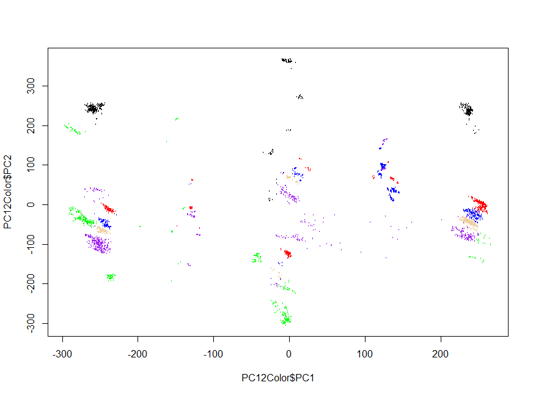

# Gesture Controlled Drone

Implementing a Drone that recognizes basic human gestures.

### Prerequisites

```
Install openpose from: https://github.com/CMU-Perceptual-Computing-Lab/openpose
Instruction: https://github.com/CMU-Perceptual-Computing-Lab/openpose/blob/master/doc/installation.md
Video Tutorial: https://www.youtube.com/watch?v=QC9GTb6Wsb4&feature=youtu.be
```

### Set up your directory structure:

```
  openpose
  Sigmoid_GCD
```

### How to run code. (Note: Stay in master directory: Sigmoid_GCD)

```
  cd Sigmoid_GCD
  python src/code_name.py
  python src/main.py for the main program. Need to have downloaded the models
  python src/create_neural_network.py to create/overwrite the model
```

### Rules & Assumptions
```
  1. Do not push training videos and images
  2. There is only one person in the frame
  3. Users will not perform dangerous maneuvers
  4. Arms always have to be present in the camera
  5. PCTx panel is open and mouse control is working
```

### Logic

```
  Manually record videos of each gestures
  Extract the keypoints of each video using gen_data_from_vids
    -manually-picked keypoints and calculate the corresponding vectors
  Run PCA as data exploration
```



```
  Preprocess the vectors to create classes and training/testing splits
  create artificial neural network model and train
  Final Testing Accuracy: ~99%
```


```
  In webcam trial, we use opencv to load in the live webcam video 
  and use the same way to extract the keypoints and calculate the vectors
  
  We proceed to predict the gestures of 10 frames, each separated by 0.05 seconds
  
  Every 10 frames/0.5 seconds, we predict the gesture in this time fram to be the 
  most predicted one in the ten frames. If the most voted one has fewer than 6 votes,
  then we are not confident enough to do anything

  These predicted gestures will be converted to signals to be sent to drones.
```


### Features
#### Gesture Control
```
    As shown above, we have a total of 6 explicit gestures that can control the drone. Each
    of them demonstrated in our final demo video.
```
#### Auto Recenter
```
    The drone will detect the tip of your nose and will automatically recenter towards
    it when you are off the center. This is especially useful when using the left and right
    signals.
```
#### Semi Collision Avoidance
```
    We've implemented our algorithm to calculate the possible distance between the drone
    and the user. If the shoulder width appearing too large on screen, then the user is
    too close to the drone. The drone will receive a offset signal to attempt to back away.
    However, be noted that it is always safer if you don't perform dangerous maneuvers.
```
